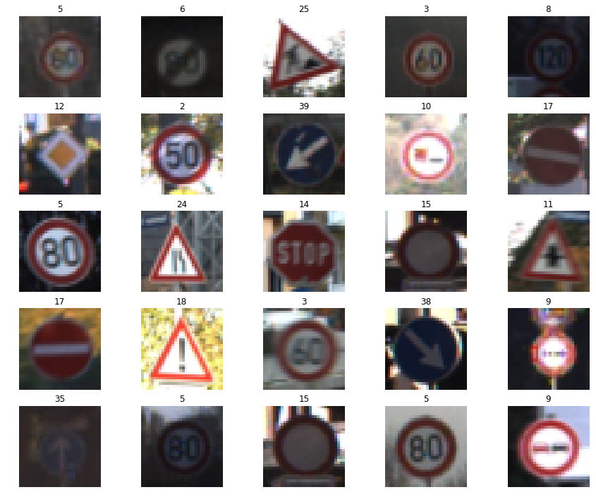
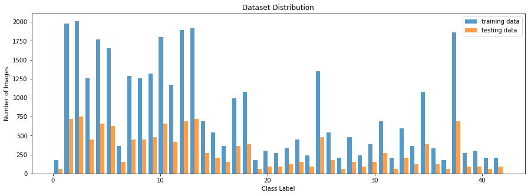
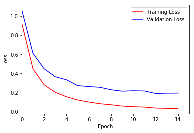
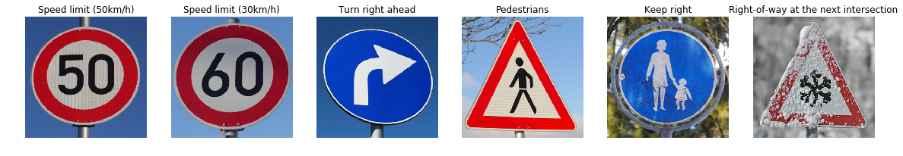

## Traffic Sign Recognition Project

Overview 
---
This project utilizes deep neural networks and convolutional neural networks to classify traffic signs.  A model is trained and validated  so it can classify sign images using the [German Traffic Sign Dataset](http://benchmark.ini.rub.de/?section=gtsrb&subsection=dataset).

Dependencies
---
[CarND Term1 Starter Kit](https://github.com/udacity/CarND-Term1-Starter-Kit).  Click [here](https://github.com/udacity/CarND-Term1-Starter-Kit/blob/master/README.md) for installation instructions.   

Dataset Summary & Exploration
---
* Number of training examples = 34799
* Number of validation examples = 4410
* Number of testing examples = 12630
* Image data shape = (34799, 32, 32, 3)
* Number of classes = 43

#### Raw data sample: 
 

#### Dataset Distribution:
 

Model Architecture
---
The LeNet architecture, credited to http://yann.lecun.com/exdb/publis/pdf/lecun-98.pdf and https://github.com/udacity/CarND-LeNet-Lab/, is the primary model used for training and classifying traffic signs. It takes a 32x32 input with 3 different color channels(RGB), which is processed by a convolutional layer, next by a pooling layer. It goes through another sequence of convolution layers and pooling layers and the input goes through an output layer in the end outputting 43 different classes. The original model does not include dropout; however, it was added to improve my model and to help with overfitting. Dropout ensures my network to not rely on any given activation to be present, forcing it to learn a redundant representation for everything to ensure some information remains.

 

Source: Yan LeCun

Unlike traditonal ConvNets, the type of non-linearities used is different:

* by the use of connections that skip layers
* by the use of pooling layers with different subsampling ratios for the connections that skip layers and for those that do not

#### Training Accuracy 

 

Testing the Model on New Images 
---

The model was used to identify images found on the web showcased an accuracy of 50%.  One of the images however, did not belong to the training dataset so it was expected that the model was unable to make the right prediction.  For improvements, I believe utilizing different pre-processing techniques for the data set can resolve the issue.   

Conclusion
---

The LeNet architecture is a great model demonstrating the capabilities of neural networks.  Evidently, there some limitations as shown by the inaccuracies it had on new images.  However, this can definitely be resolved by fine-tuning the parameters or enhancing the images of the dataset.  

For future implementations, I would consider exploring more recent and advanced architectures such as AlexNet and GooLeNet for comparison and analyze their performance.  
